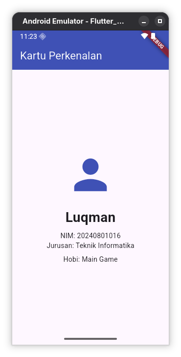

# Tugas Praktikum Flutter Pertemuan 1

## Identitas

- **Nama:** Luqman Syahreno
- **NIM:** 20240801016
- **Program Studi:** Teknik Informatika
- **Mata Kuliah:** Pemrograman Mobile
- **Pertemuan:** 1 - Pengenalan Flutter, Instalasi, dan Aplikasi Pertama

## Deskripsi Tugas

Membuat aplikasi **Kartu Perkenalan** satu halaman berdasarkan modul praktikum Flutter Pertemuan 1. Aplikasi menampilkan ikon, nama, NIM, jurusan, dan hobi menggunakan widget Flutter dasar.

## Ketentuan Tugas

- Menggunakan `Column`, `Text`, `Icon`, dan `SizedBox`.
- Menampilkan seluruh informasi identitas dalam satu halaman.
- Menyusun informasi secara vertikal di tengah layar.
- Mengumpulkan tangkapan layar aplikasi yang sedang berjalan.
- Menyertakan tautan repositori atau berkas `main.dart`.

## Berkas Implementasi

Implementasi tugas terdapat pada [`lib/tugas/main.dart`](../lib/tugas/main.dart).

## Cara Menjalankan

Jalankan perintah berikut dari folder `pertemuan1`:

```bash
flutter pub get
flutter run -t lib/tugas/main.dart
```

## Hasil Tugas

Aplikasi **Kartu Perkenalan** menampilkan:

- Ikon profil sebagai pengganti foto.
- Nama: Luqman.
- NIM: 20240801016.
- Jurusan: Teknik Informatika.
- Hobi: Main Game.

Layout aplikasi menggunakan `Center` dan `Column` untuk menempatkan informasi secara vertikal di tengah layar. Jarak antar elemen diatur menggunakan `SizedBox`.

## Screenshot Aplikasi


