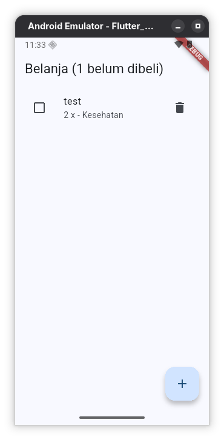
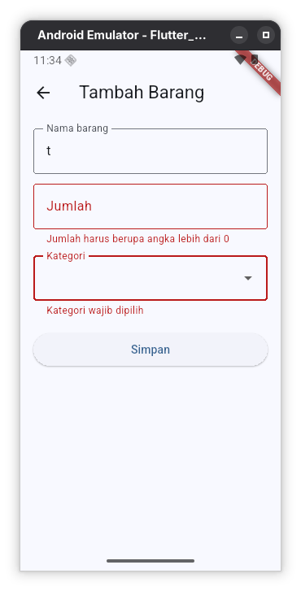

# Tugas Praktikum Flutter Pertemuan 3

## Identitas

- **Nama:** Luqman Syahreno
- **NIM:** 20240801016
- **Program Studi:** Teknik Informatika
- **Mata Kuliah:** Pemrograman Mobile
- **Pertemuan:** 3 - Form Input dan State Management

## Deskripsi Tugas

Membuat aplikasi **Daftar Belanja** berdasarkan modul praktikum Flutter Pertemuan 3. Aplikasi memiliki form untuk menambahkan barang dan halaman daftar untuk mengelola barang belanja.

## Ketentuan Tugas

- Form tambah barang memiliki isian nama barang, jumlah, dan kategori.
- Nama barang wajib diisi.
- Jumlah wajib berupa angka lebih dari 0.
- Kategori wajib dipilih melalui dropdown.
- Halaman daftar menampilkan semua barang.
- Setiap barang dapat dicentang sebagai **sudah dibeli**.
- Setiap barang dapat dihapus.
- State disimpan dalam satu `ChangeNotifier` dan dibagikan menggunakan Provider.
- AppBar menampilkan jumlah barang yang belum dibeli.
- Mengumpulkan tangkapan layar halaman daftar, halaman form, dan pesan error validasi.
- Menyertakan berkas `main.dart` atau tautan repositori.

## Berkas Implementasi

Implementasi tugas terdapat pada [`lib/tugas/main.dart`](../lib/tugas/main.dart).

## Dependensi

Aplikasi menggunakan paket [`provider`](https://pub.dev/packages/provider), yang sudah tercantum di `pubspec.yaml`.

Jika dependensi belum terpasang, jalankan:

```bash
flutter pub get
```

## Cara Menjalankan

Jalankan perintah berikut dari folder `pertemuan3`:

```bash
flutter run -t lib/tugas/main.dart
```

## Hasil Tugas

Aplikasi **Daftar Belanja** memiliki dua halaman utama:

1. **Halaman Daftar Belanja** menampilkan nama, jumlah, dan kategori barang. Checkbox digunakan untuk menandai barang yang sudah dibeli, sedangkan tombol hapus digunakan untuk menghapus barang.
2. **Halaman Tambah Barang** menyediakan input nama barang, jumlah, dan kategori. Tombol simpan hanya berhasil jika seluruh input valid.

State aplikasi dikelola oleh `BelanjaModel` yang merupakan turunan `ChangeNotifier`. `context.watch` digunakan agar halaman daftar memperbarui tampilan ketika data berubah, sedangkan `context.read` digunakan pada callback untuk menambah, mengubah, dan menghapus data.

## Screenshot Halaman Daftar



## Screenshot Form dan Validasi



